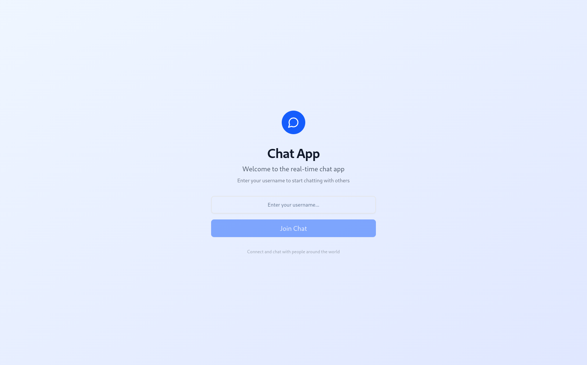
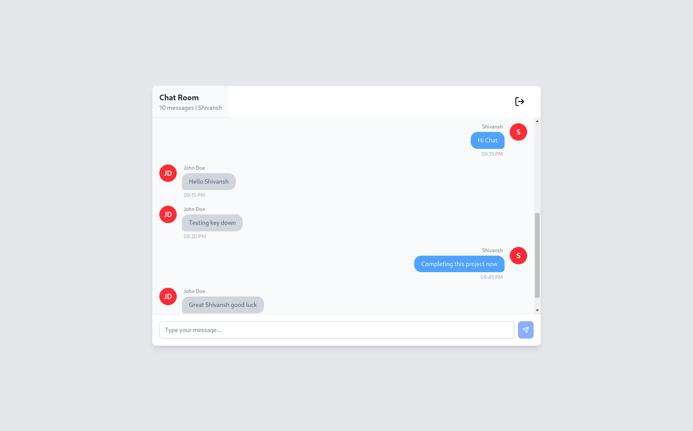

# 📱 Real-Time Chat App

A simple real-time chat application enabling users to communicate with each other instantly. It features live message transmission using WebSockets, asynchronous I/O handling, and message history retrieval.

---

## Deployment Link

- Client - https://chat-app-one-alpha-26.vercel.app
- Server - https://chat-app-server-vpn5.onrender.com

---

## 🚀 Features

- ✅ Real-time communication between users.
- 🔌 WebSocket integration for instant message transfer.
- ⚡ Asynchronous I/O for handling multiple concurrent users efficiently.
- 🕓 Message history retrieval (up to the last 50 messages).

---

## 🧠 Application Architecture

- The app uses **WebSockets** to enable real-time messaging between users.
- On server startup, the backend connects to the **MongoDB** database.
- Users are first prompted to enter a **username**.
- Once the username is submitted, a **WebSocket connection** is established between the frontend and backend.
- Upon successful connection:
  - The server fetches the **latest 50 messages** from the database.
  - These messages are sent to the client and rendered on the chat screen.
- When a user sends a message:
  - The message (along with the username and timestamp) is stored in the database.
  - Simultaneously, the message is **broadcast to all connected clients** using async I/O (non-blocking).
- When a user exits the chatroom:
  - The WebSocket connection is **gracefully closed**, and the user is redirected to the welcome screen.

---

## 🖼️ UI Preview

<!-- You can insert your image link here -->




---

## 🛠️ Setup Instructions

### 1. Clone the Repository

```bash
git clone https://github.com/shivyadev/Real-Time-Chat-App-Assignment.git
```

### 2. Frontend Setup

- Navigate to the `frontend` directory.
- Then run the below commands to install necessary dependencies.

```bash
cd frontend
npm install
```

> ⚠️ Make sure you have **Node.js** and **npm** installed on your system.

---

### 3. Backend Setup

- Go to the `backend` directory.
- Then run the below commands to install the necessary dependencies.

```bash
cd backend
npm install
```

> ⚠️ Before running the backend, create a `.env` file inside the `backend` directory with the following environment variable:

```env
MONGO_URL=your_mongodb_connection_string
```
